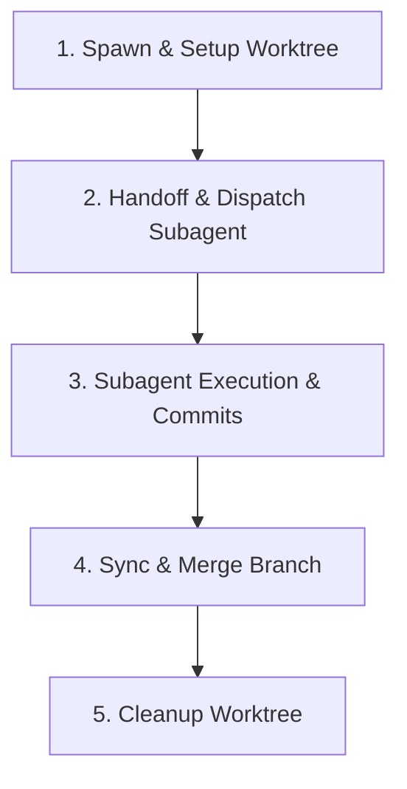

# Git Worktree & MCP Skill (`git-worktree`)

This skill defines the isolation protocol for running parallel agents in dedicated Git worktrees and the usage patterns for Git Model Context Protocol (MCP) servers.

---

## 🌲 1. Git Worktree Isolation Flow

When running multiple agents concurrently, we isolate their environments under `.worktrees/` in the project root to prevent index locks, dependency conflicts, and uncommitted change overrides.

### Worktree Management Script

Worktree operations are handled by the [`manage_worktree.py`](scripts/manage_worktree.py) script with three subcommands:

| Command | Usage | Action |
| :--- | :--- | :--- |
| `create` | `python .agents/skills/git-worktree/scripts/manage_worktree.py create <slug> <branch>` | Creates `.worktrees/<slug>` on `<branch>`, ensures `.gitignore` entry |
| `clean` | `python .agents/skills/git-worktree/scripts/manage_worktree.py clean <slug> <branch>` | Removes worktree and deletes local branch |
| `list` | `python .agents/skills/git-worktree/scripts/manage_worktree.py list` | Lists all active worktrees |

Or via the Taskfile shortcuts: `task worktree:create SLUG=<slug> BRANCH=<branch>`, `task worktree:clean`, `task worktree:list`.

---

## 🔄 2. Worktree Execution Lifecycle

The Orchestrator coordinates the worktree lifecycle across five distinct phases:

| Phase | Action | Commands / Steps |
| :--- | :--- | :--- |
| **1. Spawn** | Create worktree and branch | Call `setup_worktree(task_slug, branch_name)` |
| **2. Dispatch** | Initialize handoff metadata | Write `docs/handoffs/subagent_dispatch.md` in the worktree path with `branch_name` and `worktree_path` fields. |
| **3. Execute** | Subagent writes code | Subagent operates inside worktree directory. Stages and commits files locally using `caveman-commit`. |
| **4. Sync** | Merge changes back to main | Orchestrator runs `git merge <branch-name>` from the main repository. |
| **5. Clean** | Remove worktree and branch | Run `git worktree remove <worktree-path>` followed by `git branch -d <branch-name>`. |

---

## 🛠️ 3. Git MCP Server Integration

We leverage model-context tools to execute git actions programmatically.

### Local Git MCP Server (`mcp-server-git`)
* **Use Case**: Used strictly for the **current repository** (`ai-setup` or the active project stack).
* **Key Commands & Mappings**:
  * **Staging**: `git_add` - stage modified files before handoff.
  * **Committing**: `git_commit` - commit staged files using the Conventional Commits format (via the `caveman-commit` skill rules: brief subjects, concise explanations).
  * **Status**: `git_status` - verify dirty file status and clean working tree before starting task worktrees.
  * **History**: `git_log` - review commit history to trace parent state.

### Remote GitMCP (`gitmcp.io`)
* **Use Case**: Used to research or investigate public repositories, external frameworks, shared modules, or template configs.
* **Usage Rules**:
  * When a user requests to review or extract ideas/code from a public repository, convert it into an MCP server using `gitmcp.io`.
  * Do NOT clone remote templates manually. Query the remote GitMCP server to fetch only the files or directories needed.
  * *Authentication & Scope*: Remote GitMCP is read-only for public repositories unless explicit user access tokens are provided for remote writes.

---

## 👥 4. Parallel Execution Models

To support multiple agents running concurrently without conflict, we categorize worktree execution into two patterns:

### A. Delegated Subagents (Orchestrator-driven)
* **Setup**: Spawned by a parent Orchestrator. The parent creates the worktree and branches, then writes the `docs/handoffs/subagent_dispatch.md` file detailing the single-purpose scope and target persona.
* **Routing**: The subagent detects `subagent_dispatch.md` upon boot, bypasses standard classification, adopts the designated persona (e.g. `@engineer`), and executes the specific checklist.
* **Verification & Cleanup**: Once done, the subagent notifies the parent. The parent audits the diff, merges the branch, and removes the worktree.

### B. Independent Branch Agents (Feature-driven)
* **Setup**: Spawned directly on a dedicated worktree/branch by the user or an automated script, but without a parent dispatch card.
* **Routing**: Since no `subagent_dispatch.md` is found, the agent runs the standard request classifier and adopts the appropriate role for each prompt.
* **Lifecycle**: The agent executes the full 3-Stage Lifecycle (**Pre-coding** planning, **Coding** implementation, and **Post-coding** verification) locally on its branch.
* **Consolidation**: Once verification is complete, the branch is merged back to `main`, consolidating all plans and code additions.
